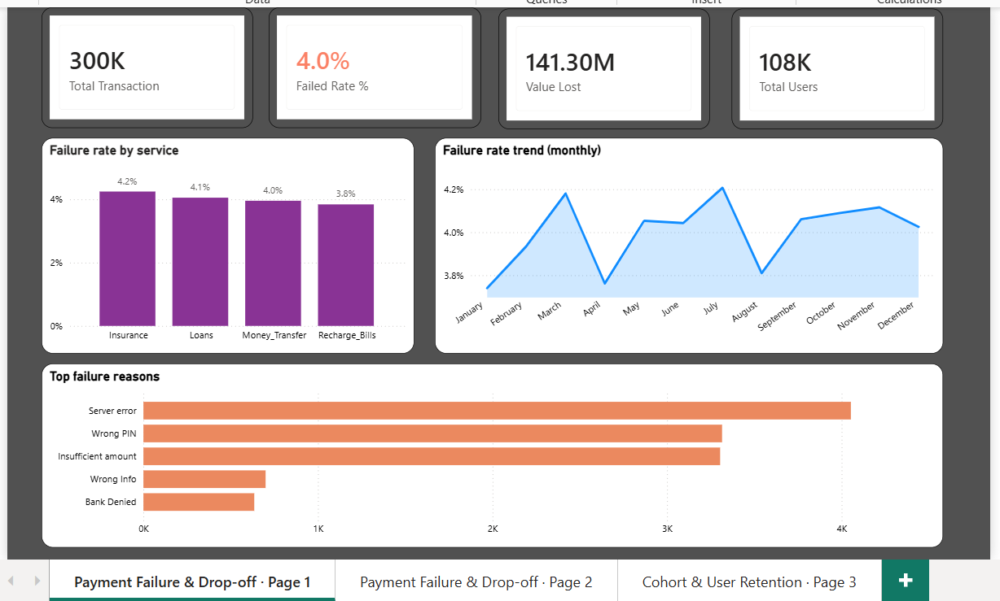
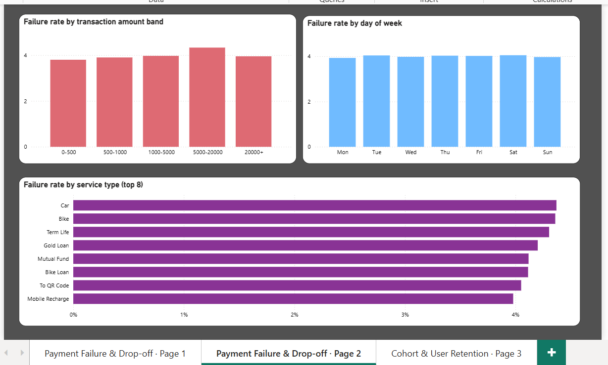
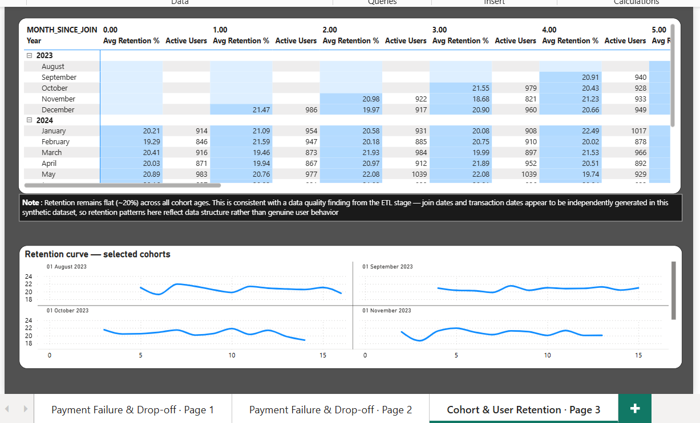

# PhonePe Fintech Analytics: Payment Failure & Cohort Retention Analysis

## Short Description / Purpose
An end-to-end analytics project analyzing a simulated PhonePe-style digital payments dataset (300,000 transactions, 107,658 users) to investigate two core business questions: **why do payments fail**, and **do users stay active over time after joining**. The project covers the full pipeline from raw data cleaning to an interactive business dashboard, with an emphasis on validating findings rather than accepting numbers at face value.

> Note: This project uses a *simulated* dataset modeled after PhonePe's ecosystem, not real proprietary transaction data.

## Tech Stack
- **Python (Pandas)** — data cleaning and ETL
- **Snowflake** — cloud data warehouse, SQL-based analysis (CTEs, window functions, DATEDIFF-based cohort logic)
- **Power BI** — interactive dashboard and visualization
- **Jupyter Notebook** — pipeline development and Snowflake connectivity

## Features / Highlights
- Cleaned and validated two relational datasets (`transactions`, `users`) totaling ~408K records, with zero nulls, zero duplicates, and zero orphaned foreign keys after processing
- Identified and resolved a critical data integrity issue — 52% of transactions had dates preceding the associated user's join date — isolating a valid subset for cohort analysis while preserving full data for failure analysis
- Built 9+ SQL views in Snowflake covering failure analysis (by service, amount band, day of week, monthly trend) and cohort retention (join-month cohorts, months-since-join, censored-cohort handling for users outside the data's observable window)
- Designed a 3-page Power BI dashboard:
  - **Failure Overview** — KPIs, failure rate by service, monthly trend, top failure reasons
  - **Failure Deep Dive** — failure rate by transaction amount band, day of week, and service type
  - **Cohort Retention** — retention heatmap matrix, multi-cohort retention curves
- Statistically validated a counterintuitive finding (flat cohort retention) using correlation analysis rather than accepting the chart at face value

## Business Impact & Insights
- **4.0% overall payment failure rate**, representing **₹141.3M in lost transaction value**
- **Server errors** are the leading cause of failure (~4,000 incidents) — more than 5x the count from "Bank Denied," pointing to infrastructure reliability over user error as the primary lever for improvement
- **Failure rate increases with transaction size**, peaking in the ₹5,000-20,000 band — suggesting stricter fraud/risk checks may be contributing to failures on higher-value transfers
- **Car and Bike insurance services** show the highest failure rates among service types (~4.2%), while Mobile Recharge is the most reliable (~3.5%)
- **Cohort retention analysis revealed no meaningful decay over time** (correlation of -0.11 between tenure and retention, average retention flat at 20.7% ± 0.74 std dev across all cohorts and months). This was traced back to the underlying data-quality issue — join dates and transaction dates appear to be generated independently in this synthetic dataset — and is documented as a data limitation rather than a genuine behavioral insight, demonstrating the importance of validating assumptions before trusting a metric.

## Screenshots

